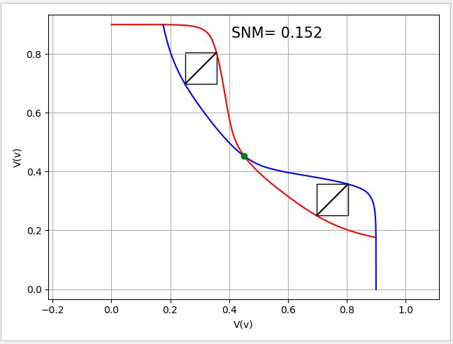

# 求SRAM 的静态噪声容限。

找两个函数与其逆函数之间最大的正方形。SNM为最大对角线长度。

思路：使用45度直线扫描，找最大值。

运行：

```python
find.py --file_path=filepath
```

```参数：
--file_path: csv文件路径
--factor: 数据扩充的倍数
```

实例：

```
find.py --file_path=./Vout_P1_N1.csv
find.py --file_path=./Vout_P1_N1.csv --factor=50
```


